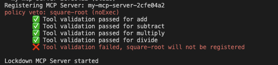
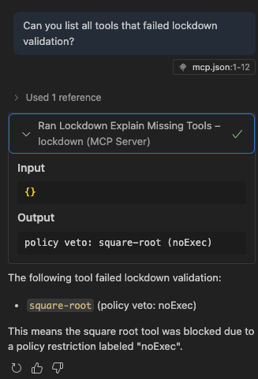
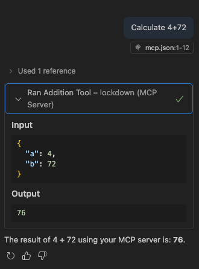

# mcp-lockdown

Lockdown is a tool that prevents MCP server tools (intended to allow agents to access external functionality/data) from causing undesirable side effects ([Impacting the way other tools run, exfiltrating data on the client machine, etc.](https://github.com/invariantlabs-ai/mcp-injection-experiments/blob/main/whatsapp-takeover.py)).

This is primarily done by defining rules and processes that can be applied to an MCP manifest to block side effects that the client may be unaware of. Lockdown acts as a proxy for your MCP tooling to ensure downstream tools continue to respect your policies.

## Why

Developers need confidence their tools are doing what they should.

Organisations need a level of control over the tools being run on a daily basis.

AI Tooling is rapidly developing, and organisations need ways to protect themselves from being taken advantage of while adopting new tooling to keep up with the demands of the tech world.

MCP is a powerful tool but opens itself to similar attacks to cross site scripting. It puts a backend server is in a position to send commands/code to a client device, so we need ways to validate those tools.

## Use Cases

This library is designed for scenarios where you need to validate MCP tool manifests before using them:

- **Enterprise environments** requiring approval of MCP tools before deployment and centralised control is desirable.
- **Security-conscious deployments** where use of 3rd party MCP tools enhances capabilities but steps are required to minimise risk
- **Compliance scenarios** where tool usage must be audited and validated
- **Development workflows** where you want to ensure tool schemas haven't changed unexpectedly

## Features

- **Bring Your Own Tools** - Use an MCP server.json file to point at MCP servers you would like to validate and use via Lockdown
- **Custom Policies** - Provide a custom `PolicyManager` to validate MCP tools against your requirements. Validate schemas, check descriptions, use your own agents to review tools, integrate with registries for futher validation.
- **Proxy Safe Tools Only** - Any tools that fail your policies will not be available for use via Lockdown.
- **Centralisation** - Self host your `LockdownServer` to share MCP configuration across your organisation.

## Built-in Policy Rules

`PolicyManager` gives you control over what policies apply to your MCPs, some built in examples that review descriptions:

- `hasDescription` - block a tool that does not have a description.
- `noFilesystem` – blocks hints of filesystem access (e.g. `fs.readFileSync`).
- `noExec` – blocks child-process execution (`exec(`, `spawn(`).
- `noEval` – blocks use of `eval(`.
- `networkAllowlist` – only allows HTTP/HTTPS URLs from trusted domains (configurable via `MCP_NETWORK_ALLOWLIST`).
- `maxDescriptionLength` – enforces a configurable character cap on tool descriptions (default: 200, configurable via `MCP_MAX_DESCRIPTION_LENGTH`).
- `noHiddenInstructions` – disallows hidden-instruction patterns (YAML frontmatter, code fences, placeholders).
- `nameConventions` – enforces lowercase alphanumeric and hyphens in tool names.
- `noZeroWidth` – blocks zero-width and invisible Unicode characters.

## Installation

```bash
npm install mcp-lockdown
```

## Usage

Example `LockdownServer` instance

```typescript
// MCP Server connection details
const lockdownServerJson = "./lockdown-mcp.json";

// custom client lockdown requirements
const pm = new PolicyManager();
pm.registerPolicies(builtInPolicies);

// create the proxy server
const lockdownServer = await LockdownServer({
    policyManager: pm,
    lockdownServerJson,
});

// connect a transport - up to you if you want to use HTTP or stdio and where to host
const transport = new StdioServerTransport();
lockdownServer.connect(transport).catch(console.error);

console.log("Lockdown MCP Server started");
```

Example `lockdown-mcp.json`

```json
{
  "servers": {
    "my-calculator": {
      "type": "stdio",
      "command": "ts-node",
      "args": ["calculator-mcp.ts"]
    }
  },
  "inputs": []
}
```

Then add Lockdown to your local MCP configuration (e.g. in VS Code reference your custom lockdown instance in `.../Code/user/mcp.json` as you would with any other MCP tools):

```json
{
 "servers": {
  "lockdown": {
   "type": "stdio",
   "command": "node",
   "args": [
    "lockdown-custom-server.js"
   ]
  }
 },
 "inputs": []
}
```

## Lockdown in Action

Examples are from the Calculator & Lockdown MCP configuration in `server-tests/`

Starting the Lockdown Server:



Asking which tools have been rejected:



Using downstream MCP tools via Lockdown proxy:



## TODOs

- Support / Test Remote MCP Servers
- Priority, conditional and chained policies
- Easier to configure, and more extensive default policies
- Registry integration?
- Caching?
- Reporting when a tool has failed
